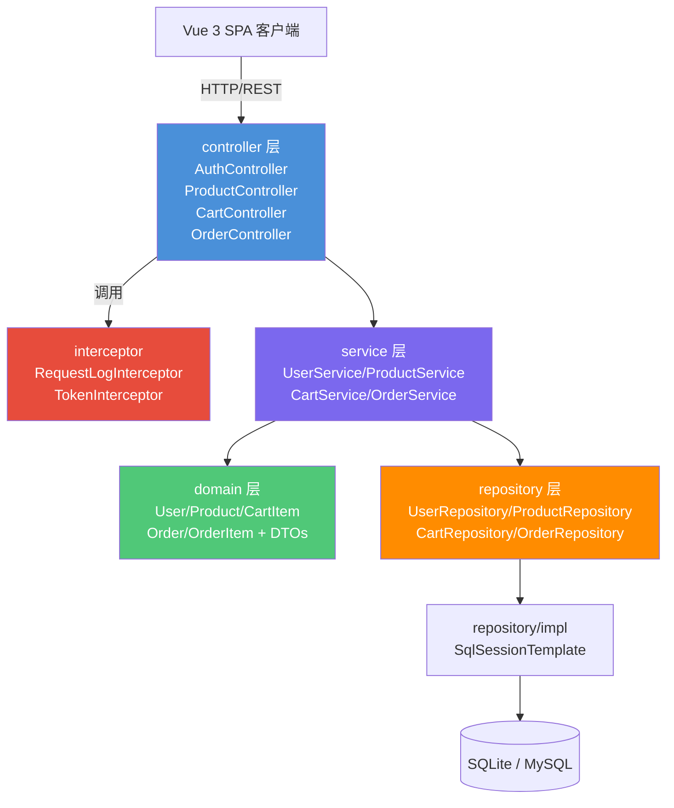

# 电商购物平台 技术设计文档

**关联需求**：[../01-product-specs/ecommerce-platform-spec.md](../01-product-specs/ecommerce-platform-spec.md)  
**文档状态**：已确认  
**创建时间**：2026-06-06  
**最后更新**：2026-06-06  
**负责人**：@dev

---

## 概述

基于 Spring Boot 2.2.x + Vue 3 构建前后端分离的电商购物平台。后端采用四层架构（Controller → Service → Repository），使用 MyBatis 作为持久层框架，Apache Shiro 进行认证授权，JWT 实现无状态 Token 认证。前端采用 Vue 3 + Vite + Bootstrap 4 构建 SPA。初期使用 SQLite 数据库，通过 Spring Profile 可平滑切换至 MySQL。

---

## 架构设计

### 组件关系图



### 数据流向

**请求处理流程**：

1. 客户端发送 HTTP 请求，携带 `Authorization: Bearer {token}` 头
2. `RequestLogInterceptor` 记录请求信息（URI、方法、参数、时间戳）
3. `TokenInterceptor` 验证 Token 有效性（除公开端点外）
4. Controller 接收请求，调用 `@Valid` 参数校验
5. Controller 将请求 DTO 传递给 Service 层
6. Service 执行业务逻辑，调用 Repository 进行数据操作
7. Repository 实现类通过 SqlSessionTemplate 与数据库交互
8. Service 将实体转换为响应 DTO
9. Controller 将 DTO 包装为统一 `Result` 格式返回

**异常处理流程**：

1. Service/Repository 抛出业务异常（`BusinessException`）
2. 全局异常处理器（`GlobalExceptionHandler`）捕获异常
3. 返回标准 `Result` 错误响应格式

---

## 接口定义

### REST API

**基础路径**：`/api`

| 方法 | 路径 | 描述 | 认证 |
|------|------|------|------|
| POST | `/api/auth/register` | 用户注册 | 否 |
| POST | `/api/auth/login` | 用户登录 | 否 |
| GET | `/api/products` | 商品分页搜索 | 否 |
| GET | `/api/products/{id}` | 商品详情 | 否 |
| GET | `/api/cart` | 查看购物车 | 是 |
| POST | `/api/cart/add` | 加入购物车 | 是 |
| PUT | `/api/cart/update` | 更新购物车数量 | 是 |
| DELETE | `/api/cart/remove/{productId}` | 删除购物车商品 | 是 |
| DELETE | `/api/cart/clear` | 清空购物车 | 是 |
| POST | `/api/orders` | 创建订单 | 是 |
| GET | `/api/orders` | 订单列表 | 是 |
| GET | `/api/orders/{id}` | 订单详情 | 是 |
| PUT | `/api/orders/{id}/cancel` | 取消订单 | 是 |

### 统一响应格式

```json
{
  "code": 200,
  "message": "success",
  "data": {}
}
```

---

## 数据模型

### 实体类

**`User` 实体**（对应表：`t_user`）：

| 字段名 | Java 类型 | 数据库类型 | 约束 | 说明 |
|--------|-----------|-----------|------|------|
| id | Long | BIGINT | PK, AUTO_INCREMENT | 主键 |
| username | String | VARCHAR(50) | NOT NULL, UNIQUE | 用户名 |
| password | String | VARCHAR(200) | NOT NULL | BCrypt 加密密码 |
| email | String | VARCHAR(100) | NULL | 邮箱 |
| phone | String | VARCHAR(20) | NULL | 手机号 |
| role | String | VARCHAR(20) | NOT NULL, DEFAULT 'USER' | 角色 |
| status | Integer | INTEGER | NOT NULL, DEFAULT 1 | 状态：1-正常，0-禁用 |
| createTime | LocalDateTime | DATETIME | NOT NULL | 创建时间 |
| updateTime | LocalDateTime | DATETIME | NOT NULL | 更新时间 |

**`Product` 实体**（对应表：`t_product`）：

| 字段名 | Java 类型 | 数据库类型 | 约束 | 说明 |
|--------|-----------|-----------|------|------|
| id | Long | BIGINT | PK, AUTO_INCREMENT | 主键 |
| name | String | VARCHAR(200) | NOT NULL | 商品名称 |
| description | String | TEXT | NULL | 商品描述 |
| price | BigDecimal | DECIMAL(10,2) | NOT NULL | 价格 |
| stock | Integer | INTEGER | NOT NULL, DEFAULT 0 | 库存数量 |
| categoryId | Long | BIGINT | NULL | 分类 ID |
| imageUrl | String | VARCHAR(500) | NULL | 商品图片 URL |
| status | Integer | INTEGER | NOT NULL, DEFAULT 1 | 状态：1-上架，0-下架 |
| createTime | LocalDateTime | DATETIME | NOT NULL | 创建时间 |
| updateTime | LocalDateTime | DATETIME | NOT NULL | 更新时间 |

**`Category` 实体**（对应表：`t_category`）：

| 字段名 | Java 类型 | 数据库类型 | 约束 | 说明 |
|--------|-----------|-----------|------|------|
| id | Long | BIGINT | PK, AUTO_INCREMENT | 主键 |
| name | String | VARCHAR(100) | NOT NULL | 分类名称 |
| parentId | Long | BIGINT | NULL | 父分类 ID |
| sortOrder | Integer | INTEGER | DEFAULT 0 | 排序 |
| createTime | LocalDateTime | DATETIME | NOT NULL | 创建时间 |

**`CartItem` 实体**（对应表：`t_cart_item`）：

| 字段名 | Java 类型 | 数据库类型 | 约束 | 说明 |
|--------|-----------|-----------|------|------|
| id | Long | BIGINT | PK, AUTO_INCREMENT | 主键 |
| userId | Long | BIGINT | NOT NULL | 用户 ID |
| productId | Long | BIGINT | NOT NULL | 商品 ID |
| quantity | Integer | INTEGER | NOT NULL, DEFAULT 1 | 数量 |
| createTime | LocalDateTime | DATETIME | NOT NULL | 创建时间 |
| updateTime | LocalDateTime | DATETIME | NOT NULL | 更新时间 |

**`Order` 实体**（对应表：`t_order`）：

| 字段名 | Java 类型 | 数据库类型 | 约束 | 说明 |
|--------|-----------|-----------|------|------|
| id | Long | BIGINT | PK, AUTO_INCREMENT | 主键 |
| orderNo | String | VARCHAR(32) | NOT NULL, UNIQUE | 订单号 |
| userId | Long | BIGINT | NOT NULL | 用户 ID |
| totalAmount | BigDecimal | DECIMAL(10,2) | NOT NULL | 总金额 |
| status | Integer | INTEGER | NOT NULL, DEFAULT 0 | 状态：0-待支付，1-已支付，2-已取消 |
| receiverName | String | VARCHAR(50) | NOT NULL | 收货人 |
| receiverPhone | String | VARCHAR(20) | NOT NULL | 收货电话 |
| receiverAddress | String | VARCHAR(500) | NOT NULL | 收货地址 |
| createTime | LocalDateTime | DATETIME | NOT NULL | 创建时间 |
| updateTime | LocalDateTime | DATETIME | NOT NULL | 更新时间 |

**`OrderItem` 实体**（对应表：`t_order_item`）：

| 字段名 | Java 类型 | 数据库类型 | 约束 | 说明 |
|--------|-----------|-----------|------|------|
| id | Long | BIGINT | PK, AUTO_INCREMENT | 主键 |
| orderId | Long | BIGINT | NOT NULL | 订单 ID |
| productId | Long | BIGINT | NOT NULL | 商品 ID |
| productName | String | VARCHAR(200) | NOT NULL | 商品名称快照 |
| productPrice | BigDecimal | DECIMAL(10,2) | NOT NULL | 商品单价快照 |
| quantity | Integer | INTEGER | NOT NULL | 数量 |
| totalPrice | BigDecimal | DECIMAL(10,2) | NOT NULL | 小计 |

### DTO

**`LoginRequest`**：

| 字段名 | Java 类型 | 校验注解 | 说明 |
|--------|-----------|---------|------|
| username | String | `@NotBlank` | 用户名 |
| password | String | `@NotBlank` | 密码 |

**`RegisterRequest`**：

| 字段名 | Java 类型 | 校验注解 | 说明 |
|--------|-----------|---------|------|
| username | String | `@NotBlank @Size(min=3, max=50)` | 用户名 |
| password | String | `@NotBlank @Size(min=6, max=100)` | 密码 |
| email | String | `@Email` | 邮箱 |
| phone | String | `@Pattern` | 手机号 |

**`OrderRequest`**：

| 字段名 | Java 类型 | 校验注解 | 说明 |
|--------|-----------|---------|------|
| receiverName | String | `@NotBlank` | 收货人 |
| receiverPhone | String | `@NotBlank` | 收货电话 |
| receiverAddress | String | `@NotBlank` | 收货地址 |

---

## 技术选型

| 技术 | 版本 | 用途 | 选择理由 |
|------|------|------|----------|
| Spring Boot | 2.2.13 | 应用框架 | 需求指定，稳定版本 |
| Spring Framework | 5.2.x | IoC/AOP | 与 Spring Boot 2.2.x 匹配 |
| Apache Shiro | 1.7.1 | 认证授权 | 需求指定，轻量级安全框架 |
| MyBatis | 3.5.x | ORM | 需求指定，SQL 可控 |
| MyBatis Spring Boot | 2.2.x | MyBatis 集成 | 与 Spring Boot 2.2.x 匹配 |
| Hibernate Validator | 6.0.x | 参数校验 | 需求指定 |
| Alibaba Druid | 1.2.x | 连接池 | 需求指定，SQL 监控 |
| SQLite JDBC | 3.34+ | SQLite 驱动 | 初期数据库 |
| MySQL Connector | 8.0.x | MySQL 驱动 | 生产数据库 |
| JWT (jjwt) | 0.9.1 | Token 生成 | 无状态认证 |
| Vue | 3.x | 前端框架 | 需求指定 |
| Vite | 4.x | 构建工具 | 现代化前端构建 |
| Vue Router | 4.x | 前端路由 | SPA 路由 |
| Pinia | 2.x | 状态管理 | Vue 3 官方推荐 |
| Axios | 1.x | HTTP 客户端 | API 请求 |
| Bootstrap | 4.6.x | UI 框架 | 需求指定 |

---

## 项目包结构

```
com.ecommerce/
├── EcommerceApplication.java          # Spring Boot 主类
├── config/                            # 配置层
│   ├── ShiroConfig.java               # Shiro 安全配置
│   ├── DruidConfig.java               # Druid 数据源配置
│   ├── MyBatisConfig.java             # MyBatis SqlSessionFactory 配置
│   ├── CorsConfig.java                # CORS 跨域配置
│   ├── DataSourceConfig.java          # 多数据源 Profile 切换
│   └── package-info.java
├── common/                            # 公共工具层
│   ├── JwtUtil.java                   # JWT Token 工具类
│   ├── Result.java                    # 统一响应包装
│   ├── Constants.java                 # 常量定义
│   └── package-info.java
├── exception/                         # 异常层
│   ├── BusinessException.java         # 业务异常
│   ├── GlobalExceptionHandler.java    # 全局异常处理器
│   └── package-info.java
├── interceptor/                       # 拦截器层（独立包）
│   ├── RequestLogInterceptor.java     # 请求日志拦截器
│   ├── TokenInterceptor.java          # Token 验证拦截器
│   ├── InterceptorConfig.java         # 拦截器注册配置
│   └── package-info.java
├── controller/                        # 表现层
│   ├── AuthController.java            # 认证接口
│   ├── ProductController.java         # 商品接口
│   ├── CartController.java            # 购物车接口
│   ├── OrderController.java           # 订单接口
│   └── package-info.java
├── service/                           # 业务逻辑层（接口）
│   ├── UserService.java
│   ├── ProductService.java
│   ├── CartService.java
│   ├── OrderService.java
│   └── package-info.java
├── service/impl/                      # 业务逻辑层（实现）
│   ├── UserServiceImpl.java
│   ├── ProductServiceImpl.java
│   ├── CartServiceImpl.java
│   ├── OrderServiceImpl.java
│   └── package-info.java
├── domain/                            # 领域模型层
│   ├── User.java                      # 用户实体
│   ├── Product.java                   # 商品实体
│   ├── Category.java                  # 分类实体
│   ├── CartItem.java                  # 购物车项实体
│   ├── Order.java                     # 订单实体
│   ├── OrderItem.java                 # 订单项实体
│   ├── dto/                           # 数据传输对象
│   │   ├── LoginRequest.java
│   │   ├── RegisterRequest.java
│   │   ├── CartRequest.java
│   │   ├── OrderRequest.java
│   │   ├── CartVO.java
│   │   └── OrderVO.java
│   └── package-info.java
├── repository/                        # 数据访问层（接口）
│   ├── UserRepository.java
│   ├── ProductRepository.java
│   ├── CartRepository.java
│   ├── OrderRepository.java
│   └── package-info.java
└── repository/impl/                   # 数据访问层（实现）
    ├── UserRepositoryImpl.java
    ├── ProductRepositoryImpl.java
    ├── CartRepositoryImpl.java
    ├── OrderRepositoryImpl.java
    └── package-info.java
```

---

## 风险与注意事项

### 技术风险

| 风险 | 影响程度 | 概率 | 应对策略 |
|------|----------|------|----------|
| SQLite 不支持某些 SQL 语法（如 ALTER TABLE MODIFY） | 中 | 中 | 使用兼容语法，通过 Profile 切换 |
| SQLite 并发写入性能差 | 中 | 中 | 初期数据量小，影响可控；后续切换 MySQL |
| Shiro + JWT 无状态集成复杂 | 中 | 低 | 自定义 StatelessToken 和 JwtFilter |
| Spring Boot 2.2.x 版本较旧 | 低 | 低 | 锁定版本，确保兼容性 |

### 注意事项

1. **SQLite 兼容性**：SQLite 不支持 MySQL 的 `AUTO_INCREMENT` 语法（使用 `AUTOINCREMENT`），建表 DDL 需要两套脚本
2. **MyBatis XML 与 SqlSessionTemplate**：Repository 实现类通过 SqlSessionTemplate 执行 SQL，Mapper XML 文件放在 `resources/mapper/` 目录
3. **并发安全**：下单时需检查库存并扣减，使用数据库行锁或乐观锁保证数据一致性
4. **事务边界**：下单操作（创建订单 + 扣减库存 + 清空购物车）需在同一事务内完成
5. **Shiro 无状态会话**：使用 `DefaultWebSessionManager` 禁用会话持久化，每次请求通过 Token 认证

---

## 测试策略

| 测试类型 | 测试类 | 测试框架 | 覆盖场景 |
|----------|--------|----------|----------|
| Service 单元测试 | `*ServiceTest` | Mockito + JUnit 5 | 正常流程、异常场景、边界条件 |
| Controller 切片测试 | `*ControllerTest` | @WebMvcTest | API 参数校验、响应格式、认证拦截 |
| Repository 切片测试 | `*RepositoryTest` | @MybatisTest | 自定义查询方法、CRUD 操作 |

---

## 变更记录

| 版本 | 日期 | 变更内容 | 变更人 |
|------|------|----------|--------|
| v1.0 | 2026-06-06 | 初始版本 | @dev |
